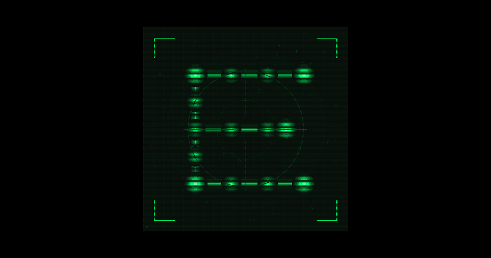

# Embeddle

A multiplayer word deduction game where players try to guess each other's secret words using semantic similarity powered by AI embeddings.

**Play now at [embeddle.vercel.app](https://www.embeddle.io)**



## 🌐 Open Source & Community-Driven

Embeddle is open source! We believe in community-driven development and welcome contributions from everyone. This is an evolving game that grows with input from players and developers alike.

### How to Contribute

- **Submit PRs** – Bug fixes, new features, UI improvements
- **Report Issues** – Found a bug? Let us know on GitHub Issues
- **Suggest Themes** – Help expand our word databases with new theme ideas
- **Share Ideas** – Game modes, cosmetics, balance suggestions

Check out our [GitHub repository](https://github.com/JamesL425/Embeddle) and see our [Contributing Guide](CONTRIBUTING.md) for more details.

---

## How to Play

1. **Setup**: Each player joins a lobby and picks a secret word from a themed word pool
2. **Gameplay**: On your turn, guess any word
3. **Reveal**: Everyone sees how similar your guess is to ALL players' secret words (as a percentage)
4. **Elimination**: Guess someone's exact word to eliminate them!
5. **Reward**: Eliminating a player lets you change your own secret word
6. **Win**: Be the last player standing

### Strategy Tips

- Pick a word that's unique but not too obscure
- Your guesses reveal info about YOUR word too - be careful!
- Use the similarity percentages to narrow down opponents' words
- If you eliminate someone, consider changing your word to reset their intel on you

---

## Architecture Overview

Embeddle uses a serverless architecture deployed on Vercel:

```
┌─────────────────────────────────────────────────────────────────┐
│                         FRONTEND                                │
│  ┌─────────────┐  ┌─────────────┐  ┌─────────────┐              │
│  │  index.html │  │  style.css  │  │    js/      │              │
│  │  (SPA)      │  │  (Styles)   │  │  (Modules)  │              │
│  └─────────────┘  └─────────────┘  └─────────────┘              │
│         │                                  │                    │
│         └──────────────┬───────────────────┘                    │
│                        ▼                                        │
│              ┌─────────────────┐                                │
│              │   API Calls     │                                │
│              │   (REST JSON)   │                                │
│              └────────┬────────┘                                │
└───────────────────────┼─────────────────────────────────────────┘
                        │
                        ▼
┌─────────────────────────────────────────────────────────────────┐
│                    BACKEND (api/index.py)                       │
│  ┌─────────────┐  ┌─────────────┐  ┌─────────────┐              │
│  │   Routes    │  │  Services   │  │  Security   │              │
│  │  /api/*     │  │ Game Logic  │  │ Auth, Rate  │              │
│  └──────┬──────┘  └──────┬──────┘  └─────────────┘              │
│         │                │                                      │
│         └────────┬───────┘                                      │
│                  ▼                                              │
│         ┌─────────────────┐       ┌─────────────────┐           │
│         │  Upstash Redis  │       │  OpenAI API     │           │
│         │  (Game State)   │       │  (Embeddings)   │           │
│         └─────────────────┘       └─────────────────┘           │
└─────────────────────────────────────────────────────────────────┘
```

### How Embeddings Work

Embeddle uses **word embeddings** – vectors in high-dimensional space that capture semantic meaning. Words with similar meanings are closer together in this space.

We measure similarity using **cosine similarity** – the cosine of the angle between two word vectors. The raw values (typically 0.2-0.6 for related words) are transformed to a more intuitive 0-100% scale for display.

**Model**: OpenAI's `text-embedding-3-large` provides high-quality semantic embeddings.

---

## Tech Stack

| Component | Technology |
|-----------|------------|
| **Backend** | Python 3.11+ serverless function (Vercel) |
| **Embeddings** | OpenAI `text-embedding-3-large` |
| **Database** | Upstash Redis (serverless) |
| **Frontend** | Vanilla HTML/CSS/JavaScript (ES modules) |
| **Auth** | Google OAuth 2.0 + JWT |
| **Hosting** | Vercel |

---

## Project Structure

```
embeddle/
├── api/                          # Backend (Python serverless)
│   ├── index.py                  # Main API handler (~9000 lines)
│   │                             # Contains all routes, game logic, auth
│   ├── config.json               # Game configuration
│   │                             # (player limits, time controls, ranked settings)
│   ├── requirements.txt          # Python dependencies
│   │
│   ├── data/                     # Data access layer
│   │   ├── redis_client.py       # Redis connection management
│   │   ├── game_repository.py    # Game state CRUD operations
│   │   └── user_repository.py    # User data operations
│   │
│   ├── security/                 # Security modules
│   │   ├── auth.py               # JWT token management
│   │   ├── rate_limiter.py       # API rate limiting
│   │   ├── validators.py         # Input validation
│   │   ├── monitoring.py         # Security event logging
│   │   └── env_validator.py      # Environment variable validation
│   │
│   ├── services/                 # Business logic (partially extracted)
│   │   ├── game_service.py       # Core game operations
│   │   ├── ai_service.py         # AI opponent logic
│   │   ├── embedding_service.py  # OpenAI embedding calls
│   │   └── economy_service.py    # Credits and shop system
│   │
│   ├── themes/                   # Theme word databases
│   │   ├── *.json                # Individual theme files (100 words each)
│   │   └── theme_registry.json   # Theme metadata
│   │
│   ├── cosmetics.json            # Cosmetic items catalog
│   ├── profanity.json            # Profanity filter wordlist
│   └── generate_themes.py        # Theme generation script
│
├── frontend/                     # Frontend (static files)
│   ├── index.html                # Single page application
│   ├── style.css                 # Main stylesheet (~9000 lines)
│   │
│   ├── js/                       # JavaScript modules
│   │   ├── main.js               # Application entry point
│   │   │
│   │   ├── state/                # State management
│   │   │   ├── gameState.js      # Current game state
│   │   │   ├── optionsState.js   # User preferences
│   │   │   ├── cosmeticsState.js # Equipped cosmetics
│   │   │   └── chatState.js      # Chat messages
│   │   │
│   │   ├── services/             # API communication
│   │   │   ├── api.js            # REST API client
│   │   │   ├── auth.js           # Authentication
│   │   │   └── polling.js        # Game state polling
│   │   │
│   │   ├── ui/                   # UI components
│   │   │   ├── screens.js        # Screen navigation
│   │   │   ├── modals.js         # Modal dialogs
│   │   │   ├── panels.js         # Side panels
│   │   │   ├── chat.js           # Chat interface
│   │   │   └── toast.js          # Notifications
│   │   │
│   │   ├── game/                 # Game-specific UI
│   │   │   ├── gameController.js # Main game logic
│   │   │   ├── playerCards.js    # Player card rendering
│   │   │   ├── wordSelection.js  # Word picking phase
│   │   │   └── history.js        # Guess history
│   │   │
│   │   └── utils/                # Utilities
│   │       ├── audio.js          # Sound management
│   │       ├── storage.js        # localStorage wrapper
│   │       └── dom.js            # DOM helpers
│   │
│   ├── css/                      # Modular CSS (alternative structure)
│   │   ├── base.css              # Variables, reset
│   │   ├── components.css        # Buttons, cards, forms
│   │   ├── layout.css            # Grid, containers
│   │   ├── game.css              # Game-specific styles
│   │   └── effects.css           # Animations, cosmetics
│   │
│   └── assets                    # Images, audio, icons
│
├── vercel.json                   # Vercel deployment config
├── CONTRIBUTING.md               # Contribution guidelines
└── README.md                     # This file
```

---

## Development

### Prerequisites

- Node.js 18+ (for Vercel CLI)
- Python 3.11+
- OpenAI API key
- Upstash Redis account (free tier works)

### Environment Variables

**Required** (set in Vercel project settings or `.env` file):

```bash
OPENAI_API_KEY=sk-...              # OpenAI API key for embeddings
UPSTASH_REDIS_REST_URL=https://... # Upstash Redis REST URL
UPSTASH_REDIS_REST_TOKEN=...       # Upstash Redis REST token
```

**Optional** (for Google OAuth authentication):

```bash
GOOGLE_CLIENT_ID=...               # Google OAuth client ID
GOOGLE_CLIENT_SECRET=...           # Google OAuth client secret
JWT_SECRET=...                     # Secret for signing JWTs (min 32 chars)
```

> ⚠️ **Security Note**: Never commit API keys or secrets to the repository. All secrets should be set as environment variables.

### Local Development

1. **Install Vercel CLI**:
   ```bash
   npm i -g vercel
   ```

2. **Link to your Vercel project and pull environment variables**:
   ```bash
   vercel link
   vercel env pull
   ```

3. **Run locally**:
   ```bash
   vercel dev
   ```

   The app will be available at `http://localhost:3000`

### Deployment

Push to the main branch – Vercel will auto-deploy.

For manual deployment:
```bash
vercel --prod
```

---

## Game Configuration

Game settings are in `api/config.json`:

```json
{
  "game": {
    "min_players": 2,
    "max_players": 6,
    "words_per_player": 16,        // Word pool size per player
    "theme_words_per_category": 100 // Words per theme
  },
  "time_controls": {
    "word_selection_time": { "ranked": 30, "casual": 60 },
    "ranked": { "initial_time": 120, "increment": 2 }
  },
  "ranked": {
    "initial_mmr": 1000,
    "k_factor": 32,
    "tier_thresholds": { "bronze": 800, "silver": 1000, ... }
  }
}
```

---

## Theme Word Sets

Themes are stored in `api/themes/` as JSON files with 100 words each.

### Regenerating Themes

```bash
# Validate existing themes
python3 api/generate_themes.py --validate-only

# Generate new themes
python3 api/generate_themes.py --model gpt-4o-mini --count 100 --min-zipf 3.0
```

Use `api/theme_overrides.json` to force-include or force-exclude specific words.

---

## API Endpoints

### Games
| Method | Endpoint | Description |
|--------|----------|-------------|
| POST | `/api/games` | Create a new game |
| GET | `/api/games/:code` | Get game state |
| POST | `/api/games/:code/join` | Join a game |
| POST | `/api/games/:code/guess` | Submit a guess |
| POST | `/api/games/:code/set-word` | Set secret word |

### Auth
| Method | Endpoint | Description |
|--------|----------|-------------|
| GET | `/api/auth/google` | Start Google OAuth |
| GET | `/api/auth/callback` | OAuth callback |
| POST | `/api/auth/logout` | Logout |

### Leaderboard
| Method | Endpoint | Description |
|--------|----------|-------------|
| GET | `/api/leaderboard` | Casual leaderboard |
| GET | `/api/leaderboard/ranked` | Ranked leaderboard |

---

## Security

- All API keys loaded from environment variables (never hardcoded)
- JWT-based authentication with token revocation
- Rate limiting on all endpoints
- Input validation and sanitization
- HTTPS enforced via Vercel
- CSP headers configured in `vercel.json`

---

## License

MIT License - see [LICENSE](LICENSE) for details.

---

## Acknowledgments

- OpenAI for the embedding model
- Vercel for hosting
- Upstash for serverless Redis
- All our contributors and players!
